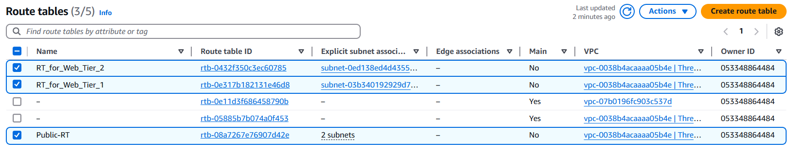

# Infrastructure definition for three tier web Application using Terraform

## Run Locally

## Terraform installed along eith aws configured is required to run the project.

## Read blog for detailed explanation of code.
[Hashnode Blog](https://nithin1.hashnode.dev/infrastructure-provisioning-for-deploying-three-tier-architecture)

Clone the project

```bash
  git clone https://github.com/Nithin-kasturi/InfraAsCode
```

Go to the project directory

```bash
  cd InfraAsCode
```

Go to the root directory

```bash
  cd root
```

Initialize dependencies

```bash
  terraform init
```

Press Enter if you are promted to enter IDS

Check validation

```bash
  terraform validate
```

Apply 

```bash
  terraform apply --auto-approve
```
## Press Enter if you are promted to enter IDS


## And you are done, visit your aws account [us-east-1] region to see the reources configured for you.

## VPC


## Resource Map of VPC


## Intenet Gateway


## Subnets 


## Route Tables


## Elastic IPs


## NAT Gateways


## Security Groups


## IAM


## S3 Bucket


## After you are done with the work, don't forget to destroy the resources to avoid unexpected charges[terraform destroy --auto-approve].

